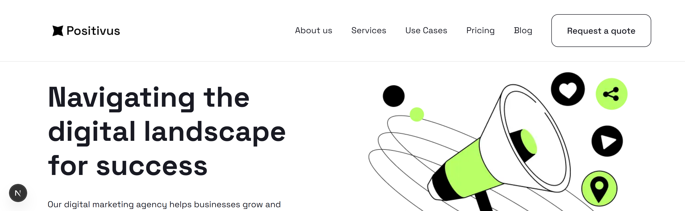
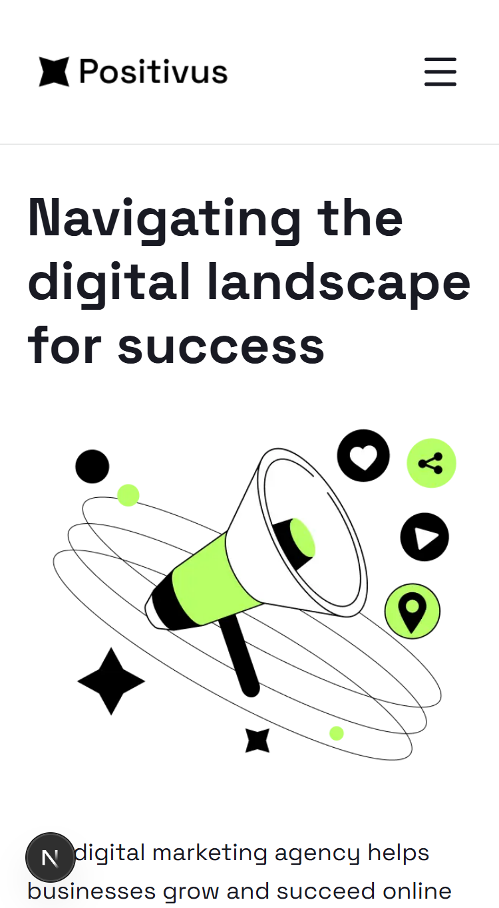

# Teste técnico - Asimov Academy Front-end - part-1

Este é um projeto Next.js que implementa uma landing page de uma agência de marketing digital.

## Deploy

O projeto está disponível em: [https://teste-tecnico-asimov-academy-fronte.vercel.app](https://teste-tecnico-asimov-academy-fronte.vercel.app)

## Como rodar o projeto

```bash
npm install
npm run dev
```

A aplicação estará disponível em `http://localhost:3000`.

### Principais tecnologias utilizadas:

- Next.js
- React
- TailwindCSS
- TypeScript

## O desafio

O desafio é implementar uma landing page de uma agência de marketing digital, reproduzindo o layout e as funcionalidades do protótipo fornecido.

## Requisitos

- Reproduzir o layout fornecido pelo [figma](https://www.figma.com/proto/lq8t05sL2J8X793V9W0z2d/Teste-T%C3%A9cnico---Asimov-Academy?type=design&node-id=1-2&t=G1x2k3Y4Z5X6Y7Z8-0)

## Previews

### Desktop



### Mobile



### Cadidato

- [Ulisses Silvério - Full Stack Developer ](https://github.com/Odisseu93)
- [Linkedin](https://www.linkedin.com/in/ulisses-silverio)
- [Portfólio](https://ulisses.tec.br)
