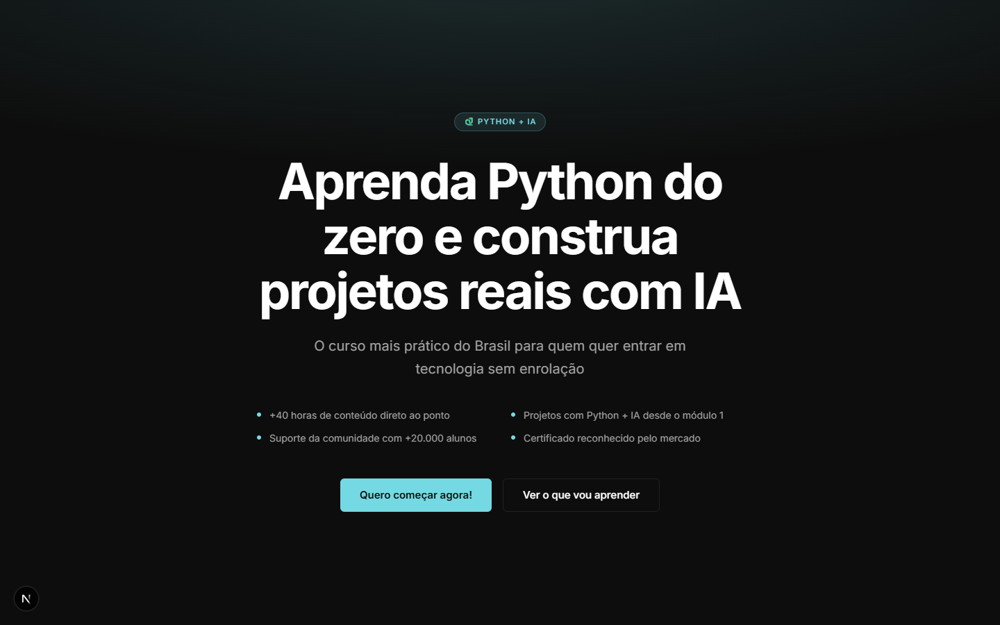
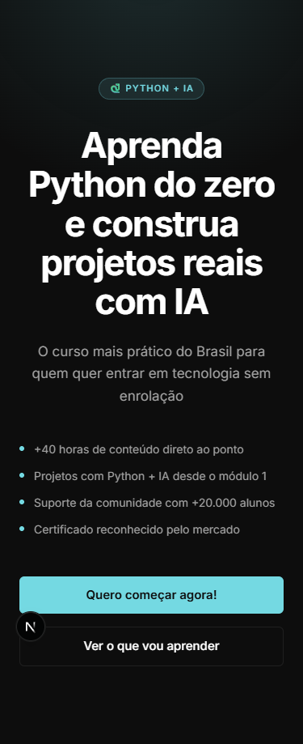

# Teste técnico - Asimov Academy Front-end - part-2

## Briefing

Construir uma seção de hero para uma landing page de curso usando o texto abaixo.

```markdown
## Headline

Aprenda Python do zero e construa projetos reais com IA

## Subheadline

O curso mais prático do Brasil para quem quer entrar em tecnologia sem enrolação

## Bullets

- +40 horas de conteúdo direto ao ponto
- Projetos com Python + IA desde o módulo 1
- Suporte da comunidade com +20.000 alunos
- Certificado reconhecido pelo mercado

## Texto de CTA

Quero começar agora!

## CTA secundário

Ver o que vou aprender

## Referências

- [Asimov Academy](https://asimov.academy) (para referência de identidade visual)
- [Linear](https://linear.app) (para referência de layout)
- [Frame.io](https://frame.io) (para referência de layout)
- [Isomeet](https://www.isomeet.com) (para referência de layout)
- [Antimetal](https://antimetal.com) (para referência de layout)
```

## Deploy

O projeto está disponível em: [link do deploy quando disponivel]()

## Como rodar o projeto

```bash
npm install
npm run dev
```

A aplicação estará disponível em `http://localhost:3000`.

### Principais tecnologias utilizadas:

- Next.js
- React
- TailwindCSS
- TypeScript

## Previews

### Desktop



### Mobile



### Cadidato

- [Ulisses Silvério - Full Stack Developer ](https://github.com/Odisseu93)
- [Linkedin](https://www.linkedin.com/in/ulisses-silverio)
- [Portfólio](https://ulisses.tec.br)
